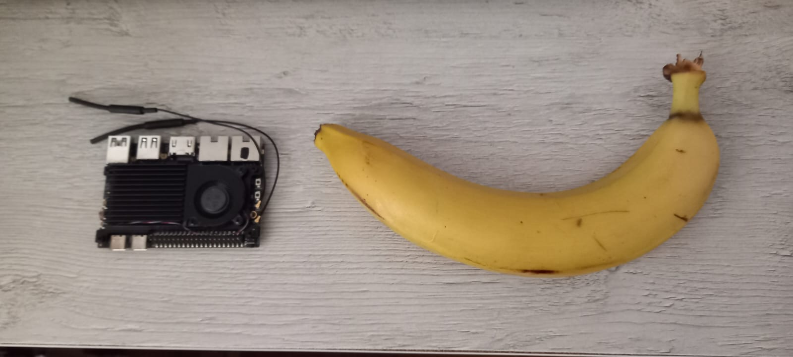

+++
date = '2026-02-12T11:22:45+04:00'
draft = true
title = 'Zero Copy Vulkan (Part 1: Input)'
math = true
tags = ["optimization", "vulkan"]
showTags = true
readTime = true
toc = true
autonumber = true
+++

<!--more-->

## To memcpy(), or not to memcpy(), that is the question

### Living on the edge

This is the first of a two-part series about using Vulkan more efficiently (with respect to memory operations).
It's called "Part 1: Input" because we will concern ourselves mainly with feeding the GPU; the second part
will be called "Part 2: Output", where we will extract the rendered image and then do something with it
(e.g. save it to disk, or stream it in the local network, etc., it's up to you).

To follow this tutorial you will need a Vulkan-capable GPU. I will be using [BananaPI M7](https://docs.banana-pi.org/en/BPI-M7/BananaPi_BPI-M7)
since it has [ARM Mali-G610](https://developer.arm.com/Processors/Mali-G610) that can run Vulkan 1.4 applications.

> Note: If you visit the link above you will see that the specification mentions Vulkan 1.2 as the most recent supported version,
but in this post we will use Mesa's [Panfrost](https://docs.mesa3d.org/drivers/panfrost.html) driver, which enables Vulkan 1.4.
I will also show how you can compile your own Vulkan drivers so that you get to enjoy the latest improvements and bug fixes
(not to mention being able to put breakpoints in the driver and observing what's happening under the hood---something that is
significantly harder to do with an OpenGL driver).

Another reason for choosing BananaPI M7 is that the sort of optimization that we will be implementing is done most often in edge
devices, where the device needs to **consume** some data produced by a sensor (or multiple sensors), do some computations, and
**produce** the final output to be redirected somewhere else. Below is an image of M7 next to an actual banana:



This thing is **small**. It also comes with a [Rockchip SoC (RK3588)](https://rockchips.net/product/rk3588/)
which, in addition to a GPU, also gives us an NPU, octa-core CPU,
and specialized hardware for image/video processing. We won't use the NPU (that will be another post in the future), but we *will*
use the hardware for encoding/decoding video frames, and of course Vulkan for doing the actual processing.

### Installing Armbian

First, download the Armbian image for BananaPI M7 [here](https://www.armbian.com/bananapi-m7/). Make sure to select the BSP kernel
version, because we will need the appropriate kernel drivers for hardware acceleration. You may use the minimal version or an image
file that comes preinstalled with a desktop environment. I will be using `Armbian 26.2.1 Gnome`; if you use something else, the instructions
may be different---you will be **on your own**.

> Note: In this tutorial we will render the GPU's output onto a window, which you won't have if you install the minimal version of Armbian.
Don't lose hope---you may use [cage](https://github.com/cage-kiosk/cage), which will *give* you a "window" when you run your Vulkan app
from tty. You don't need to compile `cage`, running `sudo apt install cage` is sufficient.

Flash the downloaded image to an SD card, for which you may use Armbian's own [flasher utility](https://github.com/armbian/imager/releases),
or [USBImager](https://bztsrc.gitlab.io/usbimager/). Then insert the SD card to BananaPI and let it boot. Follow the on-screen instructions.
Once you are presented with a GUI (or a tty console if you installed the minimal version), you will need to flash the image to internal storage
(which in my case is an eMMC storage). First, run the `lsblk` command to see a list of devices:

```bash
NAME         MAJ:MIN RM  SIZE RO TYPE MOUNTPOINTS
mmcblk1      179:0    0 29.7G  0 disk 
└─mmcblk1p1  179:1    0 29.4G  0 part /var/log.hdd
                                      /
mmcblk0      179:32   0 58.2G  0 disk 
└─mmcblk0p1  179:33   0 57.6G  0 part 
mmcblk0boot0 179:64   0    4M  1 disk 
mmcblk0boot1 179:96   0    4M  1 disk 
zram0        252:0    0  3.9G  0 disk [SWAP]
zram1        252:1    0   50M  0 disk /var/log
zram2        252:2    0    0B  0 disk
```

`/dev/mmcblk1` is the SD card, `/dev/mmcblk0` is the internal eMMC storage. Flash the armbian to eMMC using:

```bash
sudo armbian-install /dev/mmcblk0
```

Then choose `Boot from eMMC - system on eMMC` option in installer's menu.

> Note: I chose ext4 as the filesystem, and I don't think it matters for our case, but if you get weird errors/bugs in the tutorial,
you may [email](mailto:0xdeadf1sh@tuta.io) me.

Once the script finishes, it will ask us to power off the device. We will oblige. Before booting it up again, remove the SD card
from Bananapi.
