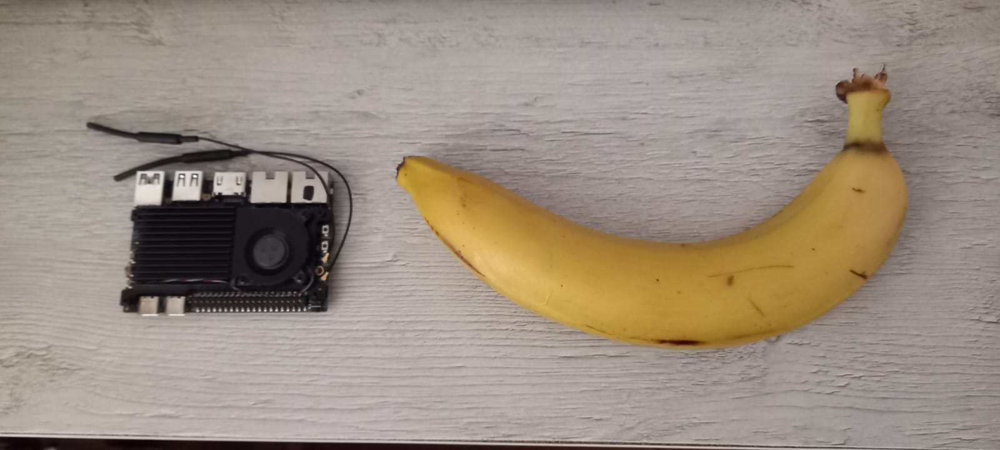
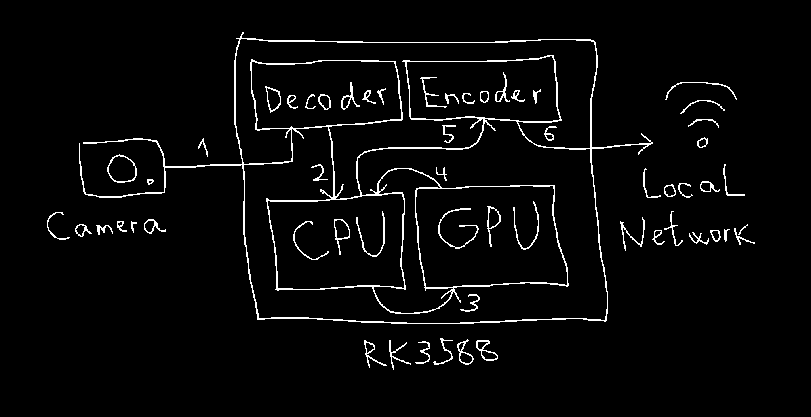

+++
date = '2026-03-02T11:22:45+04:00'
draft = true
title = 'Zero Copy Vulkan (Part 1: Input)'
math = true
tags = ["optimization", "vulkan"]
showTags = true
readTime = true
toc = true
autonumber = true
+++

<!--more-->

## memcpy() is slow?

### Living on the edge

This is the first of a two-part series about using Vulkan more efficiently in embedded systems.
It's called "Part 1: Input" because we will concern ourselves mainly with feeding the GPU; the second part
will be called "Part 2: Output", where we will extract the processed image and then do something with it
(e.g. save it to disk, or stream it to the local network, etc., it's up to you).

To follow this tutorial you will need a Vulkan-capable GPU. I will be using [BananaPI M7](https://docs.banana-pi.org/en/BPI-M7/BananaPi_BPI-M7)
since it has [ARM Mali-G610](https://developer.arm.com/Processors/Mali-G610) that can run Vulkan 1.4 applications.

> Note: If you visit the link above you will see that the specification mentions Vulkan 1.2 as the most recent supported version,
but in this post we will use Mesa's [Panfrost](https://docs.mesa3d.org/drivers/panfrost.html) driver, which enables Vulkan 1.4.
I will also show how you can compile your own Vulkan drivers so that you get to enjoy the latest improvements and bug fixes
(not to mention being able to put breakpoints in the driver and observing what's happening under the hood---something that is
significantly harder to do with an OpenGL driver).

Another reason for choosing BananaPI M7 is that the sort of optimization that we will be implementing is done most often in embedded
devices, where the device needs to **consume** some data produced by a sensor (or multiple sensors), **process** it, and
**produce** the final output to be redirected somewhere else.

Below is an image of M7 next to an actual banana:



This thing is **small**. It comes with a [Rockchip SoC (RK3588)](https://rockchips.net/product/rk3588/)
which, in addition to a GPU, also gives us an NPU, octa-core CPU,
and specialized hardware for image/video processing. We won't use the NPU (that will be another post in the future), but we *will*
use the hardware for encoding/decoding video frames, and of course Vulkan for doing the actual processing in the GPU.

### Installing Armbian

First, download the Armbian image for BananaPI M7 [here](https://www.armbian.com/bananapi-m7/). Make sure to select the BSP kernel
version, because we will need the appropriate kernel drivers for hardware acceleration. You may use the minimal version or an image
file that comes preinstalled with a desktop environment. I will be using `Armbian 26.2.1 Gnome`; if you use something else, the instructions
may be different---you will be **on your own**.

Flash the downloaded image to an SD card, for which you may use Armbian's own [flasher utility](https://github.com/armbian/imager/releases),
or [USBImager](https://bztsrc.gitlab.io/usbimager/). Then insert the SD card to BananaPI and let it boot. Follow the on-screen instructions.
Once you are presented with a GUI (or a tty console if you installed the minimal version), you will need to flash the image to internal storage
(which in my case is an eMMC storage). First, run the `lsblk` command to see a list of devices:

```bash
NAME         MAJ:MIN RM  SIZE RO TYPE MOUNTPOINTS
mmcblk1      179:0    0 29.7G  0 disk 
└─mmcblk1p1  179:1    0 29.4G  0 part /var/log.hdd
                                      /
mmcblk0      179:32   0 58.2G  0 disk 
└─mmcblk0p1  179:33   0 57.6G  0 part 
mmcblk0boot0 179:64   0    4M  1 disk 
mmcblk0boot1 179:96   0    4M  1 disk 
zram0        252:0    0  3.9G  0 disk [SWAP]
zram1        252:1    0   50M  0 disk /var/log
zram2        252:2    0    0B  0 disk
```

`/dev/mmcblk1` is the SD card, `/dev/mmcblk0` is the internal eMMC storage. Flash the armbian to eMMC using:

```bash
sudo armbian-install /dev/mmcblk0
```

Then choose `Boot from eMMC - system on eMMC` option in installer's menu.

Once the script finishes, it will ask us to power off the device. We will oblige. Before booting it up again, 
don't forget to remove the SD card from BananaPi.

### Installing dependencies

First things first, update the system with:

```bash
sudo apt update
sudo apt ugprade
```

If you don't like the default terminal emulator (Terminator), you may switch to gnome terminal by typing:

```bash
gsettings set org.gnome.desktop.default-applications.terminal exec 'gnome-terminal'
```

Now install the required packages:

```bash
sudo apt install build-essential                \
                 cmake                          \
                 pkg-config                     \
                 git                            \
                 git-lfs                        \
                 gdb                            \
                 gcc-14                         \
                 g++-14                         \
                 vulkan-tools                   \
                 vulkan-validationlayers        \
                 libvulkan-dev
```

We need `g++-14` because we will be using C++23 features like [designated initializers](https://en.cppreference.com/w/cpp/language/aggregate_initialization.html).
In your `~/.bashrc`, add the following lines:

```bash
alias gcc='gcc-14'
alias g++='g++-14'
```

If you type `vulkaninfo` now, you will get something like:

```bash
ERROR: [Loader Message] Code 0 : vkCreateInstance: Found no drivers!
Cannot create Vulkan instance.
This problem is often caused by a faulty installation of the Vulkan driver or attempting to use a GPU that does not support Vulkan.
ERROR at ./vulkaninfo/./vulkaninfo.h:458:vkCreateInstance failed with ERROR_INCOMPATIBLE_DRIVER
```

That's OK, we haven't compiled the driver yet.

> Note: To follow this tutorial, you will also need to install a text editor. I will be using neovim, and if you want to use it too,
don't install it through the package manager (it's too old). Instead, download the latest version from the [official website](https://neovim.io/).

Now grab Mesa's source code from the [archive](https://archive.mesa3d.org/):

```bash
wget https://archive.mesa3d.org/mesa-26.0.1.tar.xz
```

> Note: You may use a newer version if it is available, but make sure to check if it is compatible with the kernel version that you have installed
(this would be the BSP kernel in our case). Incompatible versions will make `vulkaninfo` output the `ERROR` message above.

Unpack it:

```bash
tar xvf mesa-26.0.1.tar.xz
```

Mesa uses [meson](https://mesonbuild.com/) as its build system, but the pre-packaged version in Armbian is too old,
so we will grab the latest one:

```bash
wget https://github.com/mesonbuild/meson/releases/download/1.10.1/meson-1.10.1.tar.gz
```

Unpack it:

```bash
tar xvf meson-1.10.1.tar.gz
```

> Note: It's convenient to have meson in the PATH; here's how I did it:
> First, I created a directory called `~/Bin` and added it to the PATH:

```bash
mkdir ~/Bin
echo 'export PATH=$HOME/Bin:$PATH' >> ~/.bashrc
source ~/.bashrc
```

> Then I created a symlink to the meson executable in the `~/Bin` directory:
```bash
cd ~/Bin
ln -s ~/meson-1.10.1/meson.py meson
```

> Now when I type `meson --version`, I get `1.10.1`. Anything that I put in `~/Bin` automatically becomes
available for use in the terminal.

Install Mesa's dependencies (I will build a Wayland-only variant, even though we won't be rendering
anything to a window in this tutorial, but it may come handy in the future):

```bash
sudo apt install python3-mako               \
                 glslang-tools              \
                 libclc-18-dev              \
                 llvm-18-dev                \
                 libllvmspirvlib-18-dev     \
                 libclang-18-dev            \
                 libwayland-dev             \
                 libwayland-egl-backend-dev \
                 libdrm-dev                 \
                 ninja-build
```

Then `cd` into the Mesa source directory and run:

```bash
meson setup build -Dplatforms=wayland           \
                  -Dgallium-drivers=panfrost    \
                  -Dvulkan-drivers=panfrost     \
                  -Dtools=panfrost              \
                  -Dvulkan-beta=true            \
                  -Dvideo-codecs=all            \
                  -Dglx=disabled                \
                  --buildtype debugoptimized
```

The last option `--buildtype debugoptimized` will give us an optimized build with debug symbols.

Now type:

```bash
meson compile -C build
```

This will build the [Panfrost driver stack](https://docs.mesa3d.org/drivers/panfrost.html), which also contains
PanVK---Vulkan driver for the Arm Mali G610 GPU.

We need to tell the Vulkan apps in our system where to find the driver:

```bash
export VK_DRIVER_FILES=$HOME/Desktop/mesa-26.0.1/build/src/panfrost/vulkan/panfrost_devenv_icd.aarch64.json
```

> Note: I put the Mesa source code in `~/Desktop`; you may need to adjust it based on where your Mesa build directory
is located.

Type:

```bash
source ~/.bashrc
```

Now `vulkaninfo | grep apiVersion` should return:

```bash
apiVersion: 1.4.335 (4211023)
```

If you are wondering what that 4211023 is, it is the 32-bit unsigned integer representation of the version. Vulkan uses
a macro called [VK_MAKE_VERSION](https://docs.vulkan.org/refpages/latest/refpages/source/VK_MAKE_VERSION.html) to
pack the components of its version (major, minor, patch) of the API in a single 32-bit integer. Here's how it is defined:

```cpp
#define VK_MAKE_VERSION(major, minor, patch) \
    ((((uint32_t)(major)) << 22U) | (((uint32_t)(minor)) << 12U) | ((uint32_t)(patch)))
```

To check that I am not actually lying, write the following C program called `test.c`:

```c
#include <vulkan/vulkan.h>
#include <stdio.h>

int main(void)
{
    printf("%u\n", VK_MAKE_VERSION(1, 4, 335));

    return 0;
}
```

Then compile and run it:

```bash
gcc test.c
./a.out
4211023
```

For image processing, we will write a compute shader, so let's download [Slang](https://shader-slang.org/) and unpack it:

```bash
wget https://github.com/shader-slang/slang/releases/download/v2026.3.1/slang-2026.3.1-linux-aarch64.tar.gz
mkdir slang && cd slang
tar xvf ../slang-2026.3.1-linux-aarch64.tar.gz
```

> Note: Vulkan drivers consume bytecode called [SPIR-V](https://docs.vulkan.org/guide/latest/what_is_spirv.html),
which means that technically you can use any shading language whose compiler can output SPIR-V bytecode. I chose Slang because I like it :)

For convenience, I create symlinks to slang executables in the `~/Bin` directory:

```bash
cd ~/Bin
ln -s $HOME/Desktop/slang/bin/slangc slangc
ln -s $HOME/Desktop/slang/bin/slangd slangd
ln -s $HOME/Desktop/slang/bin/slangi slangi
```

Now when I type `slangc -version`, I get:

```bash
2026.3.1
```

We will also be using [GStreamer](https://gstreamer.freedesktop.org/) for fetching video frames from a camera and streaming the output
of the GPU to the local network (explained in the next chapter):

```bash
sudo apt install gstreamer1.0-plugins-base          \
                 gstreamer1.0-plugins-base-apps     \
                 gstreamer1.0-plugins-good          \
                 gstreamer1.0-plugins-bad           \
                 gstreamer1.0-plugins-bad-apps      \
                 gstreamer1.0-plugins-ugly          \
                 libgstreamer1.0-0                  \
                 libgstreamer1.0-dev                \
                 libgstreamer-plugins-good1.0-dev   \
                 libgstreamer-plugins-base1.0-dev   \
                 libgstreamer-plugins-bad1.0-dev    \
                 gstreamer1.0-rtsp                  \
                 gstreamer1.0-tools                 \
                 gstreamer1.0-rockchip1
```

The most important package is `gstreamer1.0-rockchip1`---it will give us the ability to use Rockchip's hardware facilities for
image and video processing.

Rockchip comes with a [specialized hardware](https://github.com/yanyitech/rga) for 2D image processing, which we can
interface with using the RGA library:

```bash
sudo apt install librga-dev
```

That's it for all the dependencies.

### The Problem

As explained in the beginning of this tutorial, embedded devices are often used to **consume** some data from a sensor, **process** it,
and **produce** the final output to be redirected elsewhere. Here's what we are trying to achieve:



1. First, the camera output is received by the hardware decoder block and converted into raw RGB pixels.
2. Then we fetch the raw output of the decoder and store it in RAM.
3. We transfer the image from RAM to GPU's VRAM to be processed by the compute shader.
4. We copy the output of the GPU and store the new image in RAM.
5. Then we send this new image to the hardware encoder block, which will compress it to an H265 video.
6. Finally, the video is streamed to the local network.

Technically speaking the output of the encoder would go to the network adapter (the encoder itself can't stream its output to the local network),
but you get the idea.

That's 4 `memcpy()` operations in total! But is it the fastest way of solving this problem? Let's figure it out. First, we will write the implementation,
then profile it to find out how fast (or slow) `memcpy()` can be.

### Setting Up The Camera

You can use any camera for this project. I am using a cheap USB camera, which should suffice.

When the camera is plugged to the USB port, it shows up as a new device at `/dev/video0`. We can use the `v4l2-ctl` command to find which formats it supports:

```bash
v4l2-ctl -d /dev/video0 --list-formats-ext
```

In my case it produces a very long list of supported formats and resolutions. I am interested mainly in the following:

```bash
[0]: 'MJPG' (Motion-JPEG, compressed)
	Size: Discrete 1920x1080
		Interval: Discrete 0.033s (30.000 fps)
		Interval: Discrete 0.040s (25.000 fps)
		Interval: Discrete 0.050s (20.000 fps)
		Interval: Discrete 0.067s (15.000 fps)
		Interval: Discrete 0.100s (10.000 fps)
		Interval: Discrete 0.200s (5.000 fps)
```

This is a standard Full HD video made of JPEG frames. Luckily for us, the [Rockchip SoC](https://wiki.friendlyelec.com/wiki/images/e/ee/Rockchip_RK3588_Datasheet_V1.6-20231016.pdf)
in BananaPi comes with a hardware block for decoding JPEG images. So we won't need to decode it ourselves in the CPU, which would be slow. The hardware can decode 1080p video
up to 280 FPS, which is more than enough for us.

### Setting Up The Project

I will use [CMake](https://cmake.org/download/) to generate the build files---which means we need a `CMakeLists.txt`:

```cmake
cmake_version_required()
```

## memcpy() is fast?
